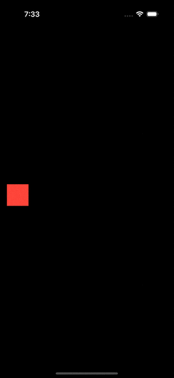
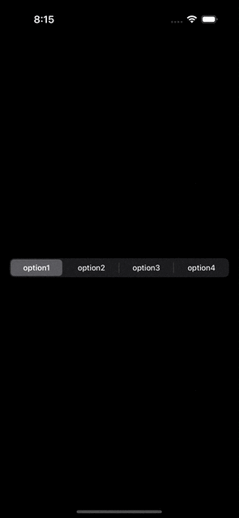
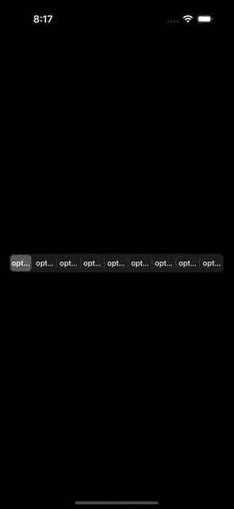
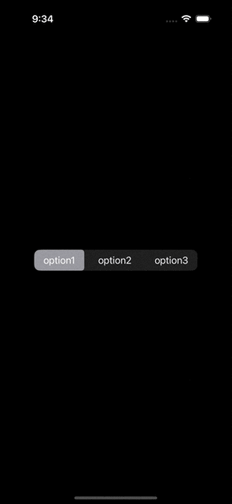
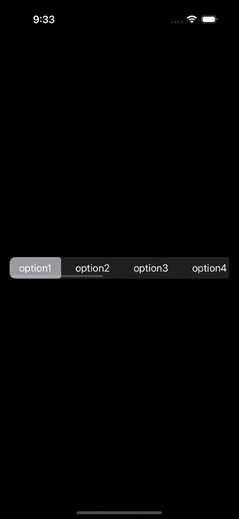

Structural identity in SwiftUI refers to how the framework understands your view hierarchy and identifies specific views without explicit identifiers. I won't delve into the specifics here, but you can find more information by searching online. Essentially, when dealing with branched views, animations may not behave as expected. For example:

```swift
struct MyView: View {

    @State private var condition: Bool = false

    var body: some View {
        Group {
            if condition {
                myView
                    .frame(width: 100, height: 100)
                    .frame(maxWidth: .infinity, maxHeight: .infinity, alignment: .trailing)
            } else {
                myView
                    .frame(width: 50, height: 50)
                    .frame(maxWidth: .infinity, maxHeight: .infinity, alignment: .leading)
            }
        }
        .padding(.horizontal)
        .onTapGesture {
            withAnimation {
                condition.toggle()
            }
        }
    }

    @ViewBuilder private var myView: some View {
        Color.red
    }
}
```


In an ideal setup, you would incorporate conditional logic within modifiers like `.frame(width: condition ? 100 : 50, height: condition ? 100 : 50)`, ensuring smooth animations. However, in certain cases, using branching views is unavoidable. Fortunately, we can utilize `.matchedGeometryEffect` to enable animations with branching views.



```swift
struct MyView: View {

    @State private var condition: Bool = false

    @Namespace private var myNamespace

    var body: some View {
        Group {
            if condition {
                myView
                    .matchedGeometryEffect(id: "myView", in: myNamespace)
                    .frame(width: 100, height: 100)
                    .frame(maxWidth: .infinity, maxHeight: .infinity, alignment: .trailing)
            } else {
                myView
                    .matchedGeometryEffect(id: "myView", in: myNamespace)
                    .frame(width: 50, height: 50)
                    .frame(maxWidth: .infinity, maxHeight: .infinity, alignment: .leading)
            }
        }
        .padding(.horizontal)
        .onTapGesture {
            withAnimation {
                condition.toggle()
            }
        }
    }

    @ViewBuilder private var myView: some View {
        Color.red
    }
}
```

By adding just three lines of code, SwiftUI can interpolate the frame rectangles of views in the window space, creating the illusion of a single view transitioning from its old position to a new one. 

When expanding the code, you'll notice that `.matchedGeometryEffect` offers other parameters, such as isSource, which we will focus on. In the above example, both views are marked as the source, as only one of them will be rendered regardless of the condition. Furthermore, `.matchedGeometryEffect` can be used to synchronize other views with the geometry of a source view. Let's take a segmented control for instance:

Normal                     |  Too many items
:-------------------------:|:-------------------------:
  |  

The segmented control exhibits a smooth animation when the selected item changes. However, issues arise when there are too many items to display, resulting in truncated text and the inability to scroll to view all options. Let's address this issue and emulate the selected animation. Here's a revised implementation:

```swift
struct MyView: View {

    @State private var myOption: MyOption = .option1

    @Namespace private var myNamespace

    var body: some View {
        ViewThatFits {
            content
            ScrollView(.horizontal) { content }
        }
        .padding()
    }

    @ViewBuilder private var content: some View {
        HStack {
            ForEach(MyOption.allCases) { option in
                Button {
                    withAnimation {
                        myOption = option
                    }
                } label: {
                    Text(option.rawValue)
                        .fixedSize()
                        .padding(.horizontal)
                        .padding(.vertical, 8)
                        .contentShape(.rect)
                }
                .buttonStyle(.plain)
                .matchedGeometryEffect(id: option, in: myNamespace, isSource: true)
            }
        }
        .background(background)
        .background(.regularMaterial)
        .clipShape(.rect(cornerRadius: 10))
    }

    @ViewBuilder private var background: some View {
        Color.secondary
            .clipShape(.rect(cornerRadius: 5))
            .matchedGeometryEffect(id: myOption, in: myNamespace, isSource: false)
    }
}
```

3 items                    |  9 items
:-------------------------:|:-------------------------:
  |  

In this revised version, we specify the source of each option as the button, ensuring that the background matches the geometry of the selected item.
