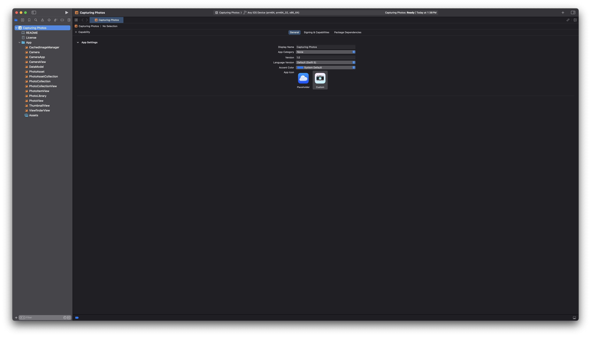
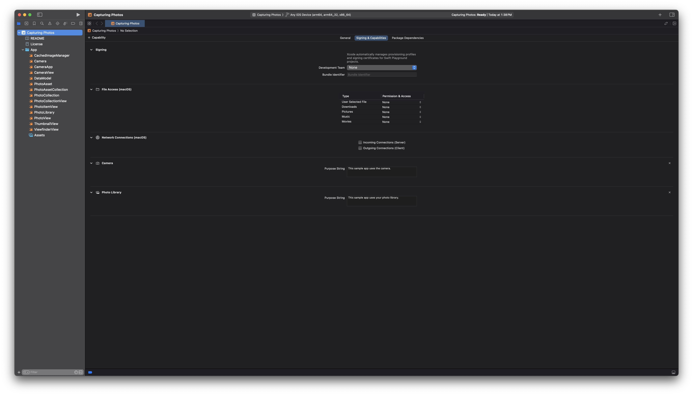
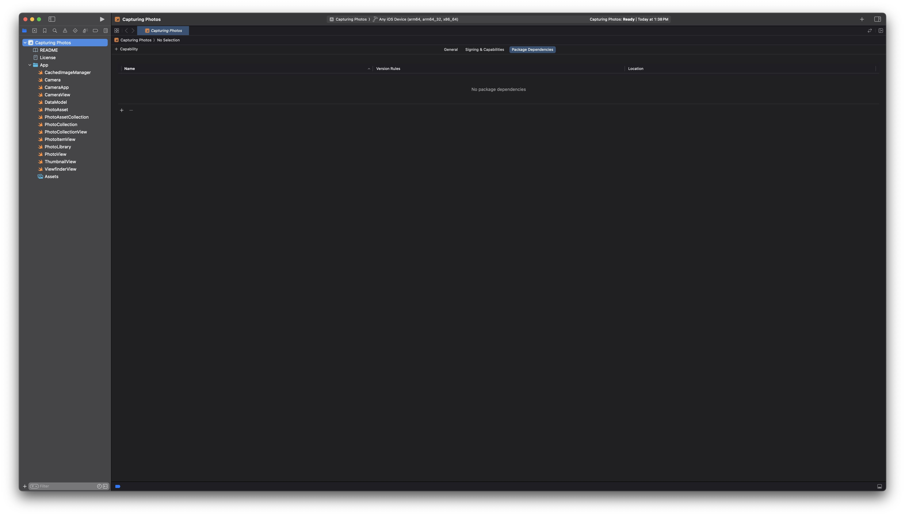

> Please note that this feature is likely experimental, as Apple has not released official documentation for it.
{: .prompt-info }

Building an iOS app inside Swift Package is no longer a dream! [Here's a sample app](https://developer.apple.com/tutorials/sample-apps/capturingphotos-camerapreview) provided by Apple that's built using Swift Package. Let's take a look at it's `Package.swift` file.

```swift
// swift-tools-version: 5.6

// WARNING:
// This file is automatically generated.
// Do not edit it by hand because the contents will be replaced.

import PackageDescription
import AppleProductTypes

let package = Package(
    name: "Capturing Photos",
    platforms: [
        .iOS("16.0")
    ],
    products: [
        .iOSApplication(
            name: "Capturing Photos",
            targets: ["App"],
            displayVersion: "1.0",
            bundleVersion: "1",
            appIcon: .asset("AppIcon"),
            supportedDeviceFamilies: [
                .pad,
                .phone
            ],
            supportedInterfaceOrientations: [

            ],
            capabilities: [
                .camera(purposeString: "This sample app uses the camera."),
                .photoLibrary(purposeString: "This sample app uses your photo library.")
            ]
        )
    ],
    targets: [
        .executableTarget(
            name: "App",
            path: "App"
        )
    ]
)
```
The process is similar to creating any other Swift Package, with the key distinction being the use of `.iOSApplication` as the product type.

When you open the package in Xcode, you will find options to run it on a simulator or a physical device. Additionally, you can configure settings such as `General`, `Signing & Capabilities`, and `Package Dependencies`, which mirror your Package.swift configurations in a user-friendly interface.

| General                                                                   | Signing & Capabilities                                                                     | Package Dependencies                                                                   |
| ------------------------------------------------------------------------- | ------------------------------------------------------------------------------------------ | -------------------------------------------------------------------------------------- |
|  |  |  |

These settings are more constrained compared to a standard Xcode project. Hopefully, Apple will expand capabilities and provide official support in the future. Until then, I wouldn't recommend building apps using Swift Package unless you're just building a very simple app like the linked sample app. 


