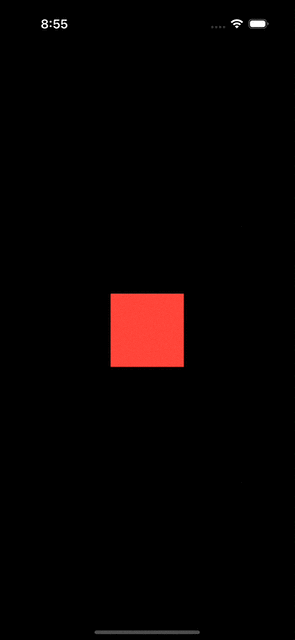

Geometry group is a special container view that's designed specifically to resolve certain animation inconsistencies that were previously challenging to manage or impossible to address effectively.

## Official definition

According to [Apple documentation](https://developer.apple.com/documentation/swiftui/view/geometrygroup()), geometry group: 

> Isolates the geometry (e.g. position and size) of the view from its parent view.

> By default SwiftUI views push position and size changes down through the view hierarchy, so that only views that draw something (known as leaf views) apply the current animation to their frame rectangle. However in some cases this coalescing behavior can give undesirable results; inserting a geometry group can correct that. A group acts as a barrier between the parent view and its subviews, forcing the position and size values to be resolved and animated by the parent, before being passed down to each subview.

## Still confused?

If you are still confused like I was, let me simplify it for you: In SwiftUI, geometry animations exclusively affect views that are currently visible on the screen.

| With geometryGroup                                            | Without geometryGroup                                            |
|---------------------------------------------------------------|------------------------------------------------------------------|
|  |  |

```swift
struct MyView: View {

    @State private var condition: Bool = false

    var body: some View {
        ZStack(alignment: .topLeading) {
            child1
            child2
        }
        .geometryGroup()
        .frame(
            width: condition ? 200 : 100,
            height: condition ? 200 : 100
        )
        .onTapGesture {
            withAnimation {
                condition.toggle()
            }
        }
    }

    @ViewBuilder private var child1: some View {
        Color.red
    }

    @ViewBuilder private var child2: some View {
        if condition {
            Color.blue
                .frame(width: 20, height: 20)
                .clipShape(.circle)
                .frame(maxWidth: .infinity, maxHeight: .infinity, alignment: .topLeading)
        }
    }
}

```

As you can see, the blue dot fails to animate correctly without the geometry group. After adding `.geometryGroup()`, the blue dot animate it's position alongside the red rectangle, which is the desired result. 

## How it works under the hood?

Let's break down the timeline sequence.

### Without geometryGroup

- (t=0) `condition` changed from `false` to `true`.
- (t=1) SwiftUI internally creates a transaction with animation information for the current state change and propagates it down the view hierarchy.
- (t=2) The `frame`, which is invisible, of the `ZStack` is adjusted, changing the size from `100x100` to `200x200`. 
- (t=3) `ZStack` propose `200x200` to both `child1` and `child2`. `child1` changes its size based on the proposed size change received from the parent view frame. Since the transaction includes animation information, this change has an animated effect. At the same time, `child2` appears with default transition animation. Since the size proposed to `child2` is `200x200` so SwiftUI just renders it in `200x200` frame.
- (t=N) The geometry animation for `child1` completes, and the transition animation for `child2` completes.

### With geometryGroup

- (t=0) `condition` changed from `false` to `true`.
- (t=1) SwiftUI internally creates a transaction with animation information for the current state change and propagates it down the view hierarchy.
- (t=2) The `frame`, which is invisible, of the `ZStack` is adjusted, changing the size from `100x100` to `200x200`.
- (t=3) `ZStack` propose `101x101` to both `child1` and `child2`. `child1` changes its size based on the proposed size. `child2` appears (with default transition animation) based on the proposed size.
- (t=4) `ZStack` propose `102x102` to both `child1` and `child2`. `child1` and `child2` changes its size based on the proposed size.
- (t=5) `ZStack` propose `103x103` to both `child1` and `child2`. `child1` and `child2` changes its size based on the proposed size.

...

- (t=N) `ZStack` stops proposing new sizes to both views, and the transition animation for `child2` completes.

In essence, geometry group propagates the geometry information contuniously along the animation timeline, ensuring that subviews acquire and maintain the correct layout positions.
