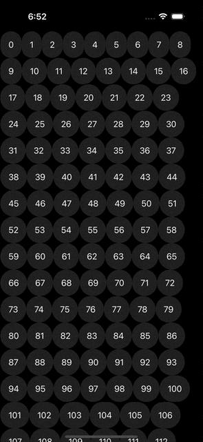
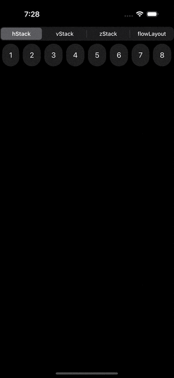

## Basics

SwiftUI offers the `Layout` protocol, enabling the precise positioning of subviews during the layout phase. This approach is notably more efficient than relying on `GeometryReader` to determine sizes and arrange views accordingly. The protocol has two required functions to implement, `sizeThatFits` and `placeSubviews`.

```swift
@available(iOS 16.0, macOS 13.0, tvOS 16.0, watchOS 9.0, *)
public protocol Layout: Animatable {

    /// Returns the size of the composite view, 
    /// given a proposed size and the view's subviews.
    func sizeThatFits(
        proposal: ProposedViewSize,
        subviews: Self.Subviews,
        cache: inout Self.Cache
    ) -> CGSize

    /// Assigns positions to each of the layout's subviews.
    func placeSubviews(
        in bounds: CGRect,
        proposal: ProposedViewSize,
        subviews: Self.Subviews,
        cache: inout Self.Cache
    )
}
```

In SwiftUI, the child view determines the size it requires, treating the parent's proposed size more as a suggestion that can be disregarded. The `sizeThatFits` function is invoked with a suggested size, and you return the total size necessary to arrange all subviews within your custom layout container. SwiftUI then calls `placeSubviews` to tell your custom layout container to place its subviews.

You might question why these operations are not consolidated into a single function. That is because the parent might call this method more than once during a layout pass with different proposed sizes to test the flexibility of the container, using proposals like:

- The `zero` proposal; respond with the layout’s minimum size.
- The `infinity` proposal; respond with the layout’s maximum size.
- The `unspecified` proposal; respond with the layout’s ideal size.

## Creating a Flow layout

One feature absent in SwiftUI is a flow layout. Flow layout operates similarly to a `HStack`, but it automatically moves to the next line when views fill the available horizontal space. Below is a simple implementation lacking adjustable spacing.

{:.left}

```swift
struct MyView: View {

    var body: some View {
        ScrollView {
            FlowLayout {
                ForEach(0..<150, id: \.self) {
                    Text("\($0)")
                        .padding()
                        .background(.regularMaterial)
                        .clipShape(.capsule)
                }
            }
        }
    }
}

struct FlowLayout: Layout {

    func sizeThatFits(proposal: ProposedViewSize, subviews: Subviews, cache: inout ()) -> CGSize {
        let containerWidth = proposal.replacingUnspecifiedDimensions().width
        let idealViewSizes = subviews.map { $0.sizeThatFits(.unspecified) }

        return dryRun(
            containerWidth: containerWidth,
            viewSizes: idealViewSizes
        ).containerSize
    }
    
    func placeSubviews(in bounds: CGRect, proposal: ProposedViewSize, subviews: Subviews, cache: inout ()) {
        let idealViewSizes = subviews.map { $0.sizeThatFits(.unspecified) }
        let viewOffsets = dryRun(
            containerWidth: bounds.width,
            viewSizes: idealViewSizes
        ).viewOffsets

        for (view, offset) in zip(subviews, viewOffsets) {
            view.place(
                at: .init(
                    x: bounds.minX + offset.x,
                    y: bounds.minY + offset.y
                ),
                proposal: .unspecified
            )
        }
    }

    private func dryRun(containerWidth: CGFloat, viewSizes: [CGSize]) -> (containerSize: CGSize, viewOffsets: [CGPoint]) {
        var containerSize: CGSize = .zero
        var viewOffsets: [CGPoint] = []

        var currentOffset: CGPoint = .zero
        var lineHeight: CGFloat = .zero

        for viewSize in viewSizes {
            if currentOffset.x + viewSize.width > containerWidth {
                currentOffset.x = 0
                currentOffset.y += lineHeight
                lineHeight = 0
            }
            viewOffsets.append(currentOffset)

            currentOffset.x += viewSize.width
            lineHeight = max(lineHeight, viewSize.height)

            containerSize.width = max(containerSize.width, currentOffset.x)
            containerSize.height = max(containerSize.height, currentOffset.y + lineHeight)
        }
        return (containerSize, viewOffsets)
    }
}
```

## Switching layout container

Another benefit is that we can leverage `AnyLayout` to enable dynamically changing the type of a layout container without destroying the state of the subviews. And we can even animate the change, like this:


{:.left}

```swift
struct MyView: View {

    @State private var layoutType: LayoutType = .hStack

    var body: some View {
        VStack {
            Picker("Layout Type", selection: $layoutType) {
                ForEach(LayoutType.allCases) {
                    Text($0.rawValue)
                }
            }
            .pickerStyle(.segmented)

            AnyLayout(layoutType.layout) {
                ForEach(0..<10, id: \.self) {
                    Text("\($0)")
                        .fixedSize()
                        .padding()
                        .background(.regularMaterial)
                        .clipShape(.capsule)
                }
            }
            .frame(maxWidth: .infinity, maxHeight: .infinity, alignment: .top)
            .animation(.default, value: layoutType)
        }
    }

    enum LayoutType: String, CaseIterable, Hashable, Identifiable {
        case hStack
        case vStack
        case zStack
        case flowLayout

        var layout: any Layout {
            switch self {
                case .hStack:
                    HStackLayout()
                case .vStack:
                    VStackLayout()
                case .zStack:
                    ZStackLayout()
                case .flowLayout:
                    FlowLayout()
            }
        }

        var id: Self { self }
    }
}
```
