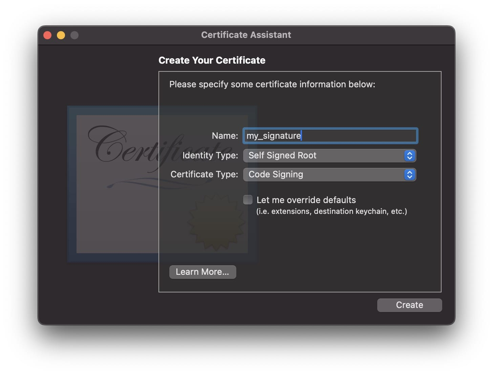

## Disclaimer

> The following tutorial is provided for educational purposes only. Reverse engineering software, hardware, or any other technology may be prohibited by law or violate the terms of service of the respective product. It is crucial to consult legal counsel to ensure compliance with all applicable laws and regulations before engaging in any reverse engineering activities.
The information presented in this tutorial is intended to demonstrate the concepts and techniques of reverse engineering. The authors do not condone or encourage the unauthorized use of reverse engineering to infringe upon intellectual property rights, circumvent security measures, or engage in any form of unethical or illegal behavior.
It is the responsibility of the reader to use the knowledge gained from this tutorial ethically and legally. The authors, contributors, and publishers of this tutorial are not liable for any misuse, damage, or legal consequences resulting from the application of the information provided herein.
By reading this tutorial, you agree to the terms outlined in this disclaimer. If you do not agree with these terms, you should not proceed.
Remember, it is essential to respect the intellectual property rights of others and to abide by the laws and regulations governing reverse engineering in your jurisdiction.
{:.prompt-warning }

## Basic knowledge

Before we proceed, let's cram some fundamental concepts of computer architecture. The programming languages we use, such as `Swift`, to write programs are typically referred to as High-Level Languages. These languages abstract away the intricate details of how computers operate. On the other hand, we have Low-Level Languages, which are closer to the hardware compared to high-level languages and provide minimal abstraction from machine instructions. This proximity allows programmers to directly manipulate hardware elements like registers and memory.

However, CPUs operate at the binary level, understanding only 0s and 1s. Therefore, we need a compiler to translate our code into binary instructions that the CPU can comprehend. A set of 0s and 1s translates into an instruction that the CPU executes. Different types of CPU architectures exist, leading to various CPU instruction sets tailored to each architecture.

## Create a sample app

> Please have Xcode installed.
{:.prompt-info}

Let's create a command-line application for experimentation. Open a text editor of your choice and paste the following Swift code snippet:

```swift
import Foundation

print("Please enter password:")

let password = readLine() ?? ""

if password == UUID().uuidString {
    print("NO WAY!")
} else {
    print("Bye Bye")
}
```

Save this file as `crackme.swift`. Next, open Terminal, navigate to the directory containing `crackme.swift`, and run `swiftc crackme.swift`. This will compile the code and generate an executable binary in the same folder. You can execute the application in Terminal and interact with it, but it will be extremely challenging to trigger the `NO WAY!` message since the password is dynamically generated at runtime.

## Examine the app

We can utilize the `strings` command to extract the strings used in the application. Additionally, combining `grep` allows us to filter for specific strings of interest using the format `strings <BINARY_PATH> | grep "<KEYWORD>"`.

```bash
> strings crackme
Please enter password:
Bye Bye
NO WAY!
```

By using the `file` command, we can determine the architecture of a binary file.

```bash
> file crackme
crackme: Mach-O 64-bit executable arm64
```

It's worth noting that a binary file may contain multiple architectures for different instruction sets.

```bash
> file /Applications/Xcode.app/Contents/MacOS/Xcode
/Applications/Xcode.app/Contents/MacOS/Xcode: Mach-O universal binary with 2 architectures: [x86_64:Mach-O 64-bit executable x86_64] [arm64:Mach-O 64-bit executable arm64]
/Applications/Xcode.app/Contents/MacOS/Xcode (for architecture x86_64):	Mach-O 64-bit executable x86_64
/Applications/Xcode.app/Contents/MacOS/Xcode (for architecture arm64):	Mach-O 64-bit executable arm64
```

To determine which architecture is used when running the program on your machine, you can utilize the `arch` command to identify the CPU architecture.

```bash
> arch
arm64
```

Next, we can employ `otool` to disassemble the binary into assembly code, revealing the low-level programming language instructions.

```bash
> otool -arch arm64 -tvV crackme
crackme:
(__TEXT,__text) section
_main:
0000000100003a6c	stp	x20, x19, [sp, #-0x20]!
0000000100003a70	stp	x29, x30, [sp, #0x10]
0000000100003a74	add	x29, sp, #0x10
0000000100003a78	sub	sp, sp, #0x100
0000000100003a7c	mov	x0, #0x0
0000000100003a80	bl	0x100003ef0 ; symbol stub for: _$s10Foundation4UUIDVMa
0000000100003a84	stur	x0, [x29, #-0x78]
0000000100003a88	ldur	x8, [x0, #-0x8]
0000000100003a8c	stur	x8, [x29, #-0x70]
0000000100003a90	ldr	x8, [x8, #0x40]
0000000100003a94	lsr	x8, x8, #0
0000000100003a98	add	x8, x8, #0xf
0000000100003a9c	and	x9, x8, #0xfffffffffffffff0
0000000100003aa0	stur	x9, [x29, #-0x68]
0000000100003aa4	adrp	x16, 1 ; 0x100004000
0000000100003aa8	ldr	x16, [x16, #0x58] ; literal pool symbol address: ___chkstk_darwin
0000000100003aac	blr	x16
0000000100003ab0	ldur	x9, [x29, #-0x68]
0000000100003ab4	mov	x8, sp
0000000100003ab8	subs	x0, x8, x9
0000000100003abc	stur	x0, [x29, #-0x60]
0000000100003ac0	mov	sp, x0
0000000100003ac4	mov	w8, #0x1
0000000100003ac8	mov	x0, x8
0000000100003acc	adrp	x8, 1 ; 0x100004000
0000000100003ad0	ldr	x8, [x8, #0x50] ; literal pool symbol address: _$sypN
0000000100003ad4	add	x1, x8, #0x8
0000000100003ad8	stur	x1, [x29, #-0x48]
0000000100003adc	bl	0x100003f20 ; symbol stub for: _$ss27_allocateUninitializedArrayySayxG_BptBwlF
0000000100003ae0	stur	x0, [x29, #-0x50]
0000000100003ae4	stur	x1, [x29, #-0x58]
0000000100003ae8	adrp	x0, 0 ; 0x100003000
0000000100003aec	add	x0, x0, #0xf50 ; literal pool for: "Please enter password:"
0000000100003af0	mov	w8, #0x16
0000000100003af4	mov	x1, x8
0000000100003af8	mov	w8, #0x1
0000000100003afc	and	w2, w8, #0x1
...
```

The `-t` flag displays the contents of the (`__TEXT`,`__text`) section. When used with the `-v` flag, it disassembles the text, and with the `-V` flag, it symbolically disassembles the operands. The `__TEXT` section in a Mach-O file contains the executable code and read-only data of a program, while the `__text` subsection within `__TEXT` specifically contains the machine code instructions that the CPU will execute.

Since this is just a simple app, there's only one function - `main` - and the part we want to crack is within that function. Having identified the function, we can then connect it to the lldb debugger for further disassembly.

```bash
> lldb crackme
(lldb) disassemble -A arm64 -bn main
crackme`main:
crackme[0x100003a6c] <+0>:   0xa9be4ff4   stp    x20, x19, [sp, #-0x20]!
crackme[0x100003a70] <+4>:   0xa9017bfd   stp    x29, x30, [sp, #0x10]
crackme[0x100003a74] <+8>:   0x910043fd   add    x29, sp, #0x10
crackme[0x100003a78] <+12>:  0xd10403ff   sub    sp, sp, #0x100
crackme[0x100003a7c] <+16>:  0xd2800000   mov    x0, #0x0 ; =0 
crackme[0x100003a80] <+20>:  0x9400011c   bl     0x100003ef0    ; symbol stub for: type metadata accessor for Foundation.UUID
crackme[0x100003a84] <+24>:  0xf81883a0   stur   x0, [x29, #-0x78]
crackme[0x100003a88] <+28>:  0xf85f8008   ldur   x8, [x0, #-0x8]
crackme[0x100003a8c] <+32>:  0xf81903a8   stur   x8, [x29, #-0x70]
crackme[0x100003a90] <+36>:  0xf9402108   ldr    x8, [x8, #0x40]
crackme[0x100003a94] <+40>:  0xd340fd08   lsr    x8, x8, #0
crackme[0x100003a98] <+44>:  0x91003d08   add    x8, x8, #0xf
crackme[0x100003a9c] <+48>:  0x927ced09   and    x9, x8, #0xfffffffffffffff0
crackme[0x100003aa0] <+52>:  0xf81983a9   stur   x9, [x29, #-0x68]
crackme[0x100003aa4] <+56>:  0xb0000010   adrp   x16, 1
crackme[0x100003aa8] <+60>:  0xf9402e10   ldr    x16, [x16, #0x58]
crackme[0x100003aac] <+64>:  0xd63f0200   blr    x16
crackme[0x100003ab0] <+68>:  0xf85983a9   ldur   x9, [x29, #-0x68]
crackme[0x100003ab4] <+72>:  0x910003e8   mov    x8, sp
crackme[0x100003ab8] <+76>:  0xeb090100   subs   x0, x8, x9
crackme[0x100003abc] <+80>:  0xf81a03a0   stur   x0, [x29, #-0x60]
crackme[0x100003ac0] <+84>:  0x9100001f   mov    sp, x0
crackme[0x100003ac4] <+88>:  0x52800028   mov    w8, #0x1 ; =1 
crackme[0x100003ac8] <+92>:  0xaa0803e0   mov    x0, x8
crackme[0x100003acc] <+96>:  0xb0000008   adrp   x8, 1
crackme[0x100003ad0] <+100>: 0xf9402908   ldr    x8, [x8, #0x50]
crackme[0x100003ad4] <+104>: 0x91002101   add    x1, x8, #0x8
crackme[0x100003ad8] <+108>: 0xf81b83a1   stur   x1, [x29, #-0x48]
crackme[0x100003adc] <+112>: 0x94000111   bl     0x100003f20    ; symbol stub for: Swift._allocateUninitializedArray<τ_0_0>(Builtin.Word) -> (Swift.Array<τ_0_0>, Builtin.RawPointer)
crackme[0x100003ae0] <+116>: 0xf81b03a0   stur   x0, [x29, #-0x50]
crackme[0x100003ae4] <+120>: 0xf81a83a1   stur   x1, [x29, #-0x58]
crackme[0x100003ae8] <+124>: 0x90000000   adrp   x0, 0
crackme[0x100003aec] <+128>: 0x913d4000   add    x0, x0, #0xf50 ; "Please enter password:"
crackme[0x100003af0] <+132>: 0x528002c8   mov    w8, #0x16 ; =22 
crackme[0x100003af4] <+136>: 0xaa0803e1   mov    x1, x8
crackme[0x100003af8] <+140>: 0x52800028   mov    w8, #0x1 ; =1 
crackme[0x100003afc] <+144>: 0x12000102   and    w2, w8, #0x1
crackme[0x100003b00] <+148>: 0x940000ff   bl     0x100003efc    ; symbol stub for: Swift.String.init(_builtinStringLiteral: Builtin.RawPointer, utf8CodeUnitCount: Builtin.Word, isASCII: Builtin.Int1) -> Swift.String
crackme[0x100003b04] <+152>: 0xf85a83a9   ldur   x9, [x29, #-0x58]
...
```

After carefully examining the assembly code, we identify the snippet below is the portion that requires modification - specifically `tbz    w0, #0x0, 0x100003d24`. This assembly code implies that if the value in the `w0` register is `0`, the program will branch to memory address `0x100003d24`. Alternatively, if the condition is not met, the CPU will execute the subsequent instruction - `b      0x100003c6c`. As we observe the presence of `NO WAY!` at `0x100003c94`, we know we should avoid branching to `0x100003d24`.

```
crackme[0x100003c4c] <+480>: 0x940000af   bl     0x100003f08    ; symbol stub for: static Swift.String.== infix(Swift.String, Swift.String) -> Swift.Bool
crackme[0x100003c50] <+484>: 0xaa0003e8   mov    x8, x0
crackme[0x100003c54] <+488>: 0xf85783a0   ldur   x0, [x29, #-0x88]
crackme[0x100003c58] <+492>: 0xb81843a8   stur   w8, [x29, #-0x7c]
crackme[0x100003c5c] <+496>: 0x940000ba   bl     0x100003f44    ; symbol stub for: swift_bridgeObjectRelease
crackme[0x100003c60] <+500>: 0xb85843a0   ldur   w0, [x29, #-0x7c]
crackme[0x100003c64] <+504>: 0x36000600   tbz    w0, #0x0, 0x100003d24 ; <+696>
crackme[0x100003c68] <+508>: 0x14000001   b      0x100003c6c    ; <+512>
crackme[0x100003c6c] <+512>: 0x52800028   mov    w8, #0x1 ; =1 
crackme[0x100003c70] <+516>: 0xaa0803e0   mov    x0, x8
crackme[0x100003c74] <+520>: 0xb0000008   adrp   x8, 1
crackme[0x100003c78] <+524>: 0xf9402908   ldr    x8, [x8, #0x50]
crackme[0x100003c7c] <+528>: 0x91002101   add    x1, x8, #0x8
crackme[0x100003c80] <+532>: 0xf81383a1   stur   x1, [x29, #-0xc8]
crackme[0x100003c84] <+536>: 0x940000a7   bl     0x100003f20    ; symbol stub for: Swift._allocateUninitializedArray<τ_0_0>(Builtin.Word) -> (Swift.Array<τ_0_0>, Builtin.RawPointer)
crackme[0x100003c88] <+540>: 0xf81303a0   stur   x0, [x29, #-0xd0]
crackme[0x100003c8c] <+544>: 0xf81283a1   stur   x1, [x29, #-0xd8]
crackme[0x100003c90] <+548>: 0x90000000   adrp   x0, 0
crackme[0x100003c94] <+552>: 0x913dc000   add    x0, x0, #0xf70 ; "NO WAY!"
crackme[0x100003c98] <+556>: 0x528000e8   mov    w8, #0x7 ; =7 
crackme[0x100003c9c] <+560>: 0xaa0803e1   mov    x1, x8
crackme[0x100003ca0] <+564>: 0x52800028   mov    w8, #0x1 ; =1 
crackme[0x100003ca4] <+568>: 0x12000102   and    w2, w8, #0x1
crackme[0x100003ca8] <+572>: 0x94000095   bl     0x100003efc    ; symbol stub for: Swift.String.init(_builtinStringLiteral: Builtin.RawPointer, utf8CodeUnitCount: Builtin.Word, isASCII: Builtin.Int1) -> Swift.String
crackme[0x100003cac] <+576>: 0xf85283a9   ldur   x9, [x29, #-0xd8]
```

## Modify the binary

There are multiple strategies to tackle this, like adjusting `w0` to a non-zero value, converting the `tbz` instruction into a no-operation (`nop`), or directly jumping to the desired location. Your creativity is the only limit. For simplicity, we will opt for the `nop` operation to transform that line into a no-op.

Given that lldb employs a big-endian system, we must reverse-read the instruction code by bytes, shifting `36000600` to `00060036`.

Next, we need to reference the [ARM documentation](https://developer.arm.com/documentation/ddi0602/2021-12/Base-Instructions/NOP--No-Operation-) to obtain the instruction code for `nop`, which is `11010101000000110010000000011111`, corresponding to `D503201F` in hexadecimal. Following the big-endian to little-endian conversion, `D503201F` becomes `1F2003D5`.

Subsequently, using any hex editor, open the binary file and substitute `00060036` with `1F2003D5`. Once this replacement is made and the patched binary is executed in the terminal, the program may instantly terminate. This occurs because modifying the code invalidates the original signature used to authenticate the binary integrity.

```bash
> ./crackme
[1]    68294 killed     ./crackme
```

However, this issue can be resolved by generating a custom signature and signing the patched binary. Open `Keychain Access.app`, navigate to `Keychain Access` in the top menu bar -> `Certificate Assistant` -> `Create a Certificate`.



After creating the signature, in the terminal, execute `codesign -fs my_signature crackme`. At this point, the process is complete!

## Enjoy

Execute the binary in the terminal and input any password. You will observe the message `NO WAY!` being displayed, signifying the successful bypass of the password verification process.

```bash
> ./crackme
Please enter password:
123
NO WAY!
```

## Too complicated?

Don't fret! There are reverse engineering applications available to assist you throughout the process, alleviating concerns about locating the OP code, managing conversions between various endian systems, and more. Personally, I find `Hopper Disassembler` to be the top choice, while `IDA Pro` is also widely favored in the field.

## Conclusion

The technique demonstrated today is known as static reverse engineering. In contrast, dynamic reverse engineering involves altering the program's memory at runtime.

It is clear that altering a binary is not excessively difficult, and there exist numerous other methods to exploit a system. When developing a system, it is crucial never to blindly trust input from external applications; always validate inputs to enhance security.
