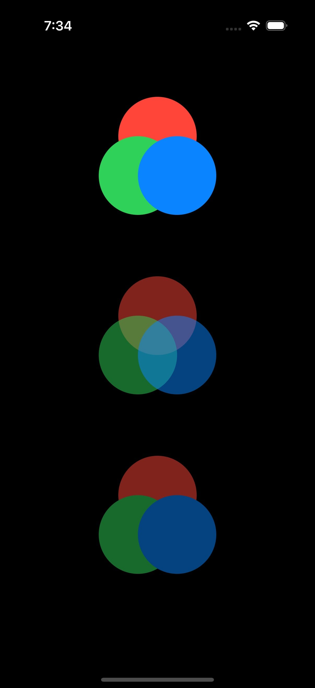

`compositingGroup()` is a lesser-known SwiftUI view modifier, yet it plays an important role in fine-tuning visual effects.

## Official definition

According to [Apple documentation](https://developer.apple.com/documentation/swiftui/view/compositinggroup()):

> A compositing group makes compositing effects in this view’s ancestor views, such as opacity and the blend mode, take effect before this view is rendered.

The visual impact of `compositingGroup()` may not be immediately apparent from Apple's example. Let’s clarify its behavior with a simpler explanation and example.

## What Does compositingGroup() Do?

The `compositingGroup()` modifier affects how ancestor effects—such as opacity or blend modes—are applied to a view. Specifically, it makes these effects apply to the view as a whole, rather than to its individual subviews. Without `compositingGroup()`, these effects are applied to each subview separately.

## Example: Visualizing the Difference

Here’s an example demonstrating the difference with and without `compositingGroup()`.

{: width="295" .left}

```swift
struct CompositingGroup: View {

    var body: some View {
        VStack(spacing: 128) {
            circles(withCompositingGroup: false, opacity: 1)
            circles(withCompositingGroup: false, opacity: 0.5)
            circles(withCompositingGroup: true, opacity: 0.5)
        }
    }

    @ViewBuilder private func circles(withCompositingGroup: Bool, opacity: Double) -> some View {
        ZStack {
            Color.red
                .frame(width: 100, height: 100)
                .clipShape(.circle)
                .offset(y: -50)

            Color.green
                .frame(width: 100, height: 100)
                .clipShape(.circle)
                .offset(x: -25)

            Color.blue
                .frame(width: 100, height: 100)
                .clipShape(.circle)
                .offset(x: 25)
        }
        .modifier(CompositingGroupViewModifier(withCompositingGroup: withCompositingGroup))
        .opacity(opacity)
    }
}

fileprivate struct CompositingGroupViewModifier: ViewModifier {

    let withCompositingGroup: Bool

    func body(content: Content) -> some View {
        if withCompositingGroup {
            content
                .compositingGroup()
        } else {
            content
        }
    }
}
```

- **Top Group**: Opacity is set to 1, so no visual difference exists between with or without `compositingGroup()`.
- **Middle Group**: Opacity is set to 0.5 without `compositingGroup()`, so each circle is individually made 50% transparent.
- **Bottom Group**: Opacity is set to 0.5 with `compositingGroup()`, so the entire group of circles is treated as a single layer and made 50% transparent.

This distinction is particularly useful when combining effects like blend modes or working with complex view hierarchies.

