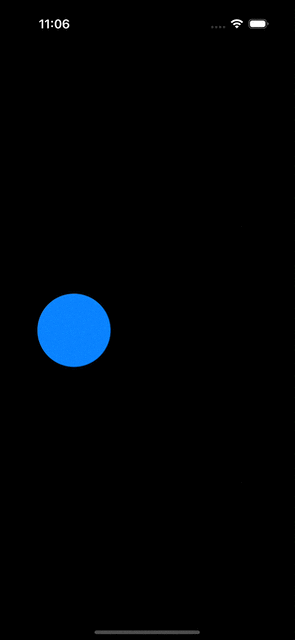

In SwiftUI, a **transition** defines how a view enters or exits the screen during animations. It enables smooth animations when adding or removing views in your app. For example:

{:.left}

```swift
struct MyView: View {

    @State private var condition: Bool = true

    var body: some View {
        Group {
            if condition {
                blueCircle
                    .offset(x: -100)
            } else {
                blueCircle
                    .offset(x: 100)
            }
        }
        .onTapGesture {
            withAnimation {
                condition.toggle()
            }
        }
    }

    private var blueCircle: some View {
        Circle()
            .fill(Color.blue)
            .frame(width: 100, height: 100)
    }
}

```

Since the two blue circles have different [structural identities](../mastering-swiftui-state/#identity), SwiftUI treats them as distinct views and does not apply geometry-based animations when `condition` changes. By default, SwiftUI uses an `opacity` transition, fading views in and out—from transparent to opaque during insertion, and vice versa during removal.

## Specifying Transitions

Transitions are applied to views using the `.transition()` modifier and can be combined for dynamic behavior.

```swift
MyView()
    .transition(.slide)
    
MyView()
    .transition(.move(edge: .leading).combined(with: .opacity))
```

You can even specify different transitions for appearing and disappearing states.

```swift
MyView()
    .transition(.asymmetric(insertion: .slide, removal: .opacity))
```

## Creating Custom Transitions

SwiftUI provides two ways to define custom transitions: by conforming to the `Transition` protocol or by using view modifiers.

### Using the `Transition` Protocol

Custom transitions can be created by applying modifiers to the view's content. For symmetric transitions, the `isIdentity` property of the transition phase determines the modifier's behavior. For asymmetric transitions, the `phase` itself can be used to configure the properties.

{:.left}

```swift
struct MyTransition: Transition {

    func body(content: Content, phase: TransitionPhase) -> some View {
        content
            .opacity(phase.isIdentity ? 1.0 : 0.0)
            .rotationEffect(phase.rotation)
    }
}

fileprivate extension TransitionPhase {

    var rotation: Angle {
        switch self {
            case .willAppear:
                .degrees(180)
            case .identity:
                .zero
            case .didDisappear:
                .degrees(-180)
        }
    }
}


```

Here, `isIdentity` indicates whether the view is currently being rendered. 

### Using View Modifiers

{:.left}

```swift
struct MyViewModifier: ViewModifier {

    let isIdentity: Bool

    @State private var idealSize: CGSize = .zero

    func body(content: Content) -> some View {
        content
            .rotationEffect(.degrees(isIdentity ? 0 : 180))
            .opacity(isIdentity ? 1 : 0)
    }
}

extension AnyTransition {

    static let myTransition: AnyTransition = .modifier(
        active: MyViewModifier(isIdentity: false),
        identity: MyViewModifier(isIdentity: true)
    )
}


```

## Caveats

- Avoid using identity-affecting changes like `.id`, `if`, or `switch` on the content of a view with a transition. These changes reset the state of the view, leading to potentially unexpected behavior when the view appears or disappears. 
- Transitions only work on conditional views (e.g., views that are added or removed based on a condition). If the view is still part of the view hierarchy (e.g., just hidden with `.opacity(0)`), the transition will not work.
- Always wrap state changes in `withAnimation` when triggering a transition. Without it, the view will be added or removed without animating the transition, resulting in abrupt changes.
