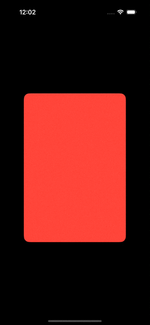

Introduced in iOS 17, the `.visualEffect` modifier offers a seamless way to apply dynamic visual effects to views. Unlike older methods, such as `scaleEffect` or `offset`, which could affect the layout or require complex workarounds, `.visualEffect` is non-intrusive—it applies effects without altering the view's frame, ensuring your layout remains stable.  

For instance, you can use `.visualEffect` in a scroll view to create engaging visual effects for subviews while preserving their layout. This ensures smooth functionality, such as scrolling, without any unintended disruptions.

{:.left}

```swift
struct MyView: View {

    var body: some View {
        ScrollView(.horizontal) {
            HStack {
                card(.red)
                card(.green)
                card(.blue)
            }
            .scrollTargetLayout()
        }
        .scrollTargetBehavior(.viewAligned)
        .scrollIndicators(.never)
        .frame(height: 400)

    }

    @ViewBuilder private func card(_ color: Color) -> some View {
        color
            .clipShape(.rect(cornerRadius: 15))
            .padding(.horizontal, 64)
            .containerRelativeFrame(.horizontal)
            .visualEffect { effect, geometryProxy in
                effect
                    .offset(x: max(0, -geometryProxy.frame(in: .scrollView(axis: .horizontal)).minX))
            }
    }
}
```
