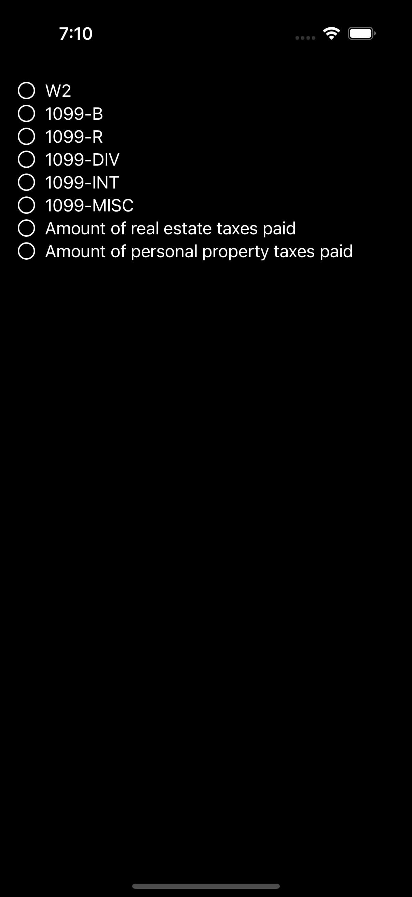
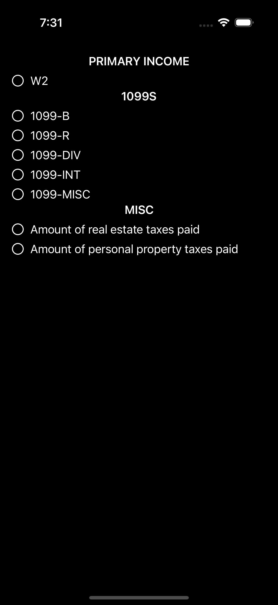
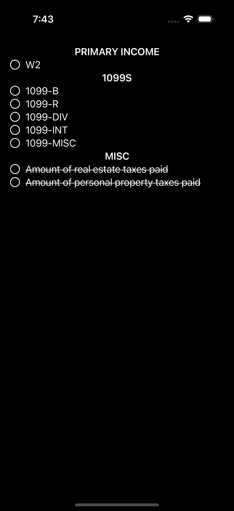

With the release of iOS 18, SwiftUI introduces a powerful new way to create custom container views.  

Before diving into the implementation, it’s essential to understand the distinction between **declared subviews** and **resolved subviews**. Let’s take a look at the following example:

```swift
struct MyView: View {

    let items = [
        "Amount of real estate taxes paid",
        "Amount of personal property taxes paid"
    ]

    var body: some View {
        List {
            Text("W2")
            Text("1099-B")
            Text("1099-R")
            Text("1099-DIV")
            Text("1099-INT")
            Text("1099-MISC")

            ForEach(items, id: \.self) { item in
                Text(item)
            }
        }
    }
}
```

In this example, the `List` contains **7 declared subviews**: six `Text` views defined explicitly and one `ForEach` view. However, at runtime, these translate into **9 resolved subviews**: the six declared `Text` views plus two additional `Text` views generated by the `ForEach`.  

In SwiftUI’s declarative framework, **declared subviews** serve as a blueprint for creating **resolved subviews** while the app is running. For instance:  

- A `ForEach` view is a declared subview that doesn’t have a specific visual representation by itself. Its sole purpose is to generate a collection of resolved subviews.  
- Similarly, a `Group` view acts as a declared container for resolved subviews. For example, a `Group` containing three `Text` views resolves into exactly three subviews.  
- Some declared subviews, such as `EmptyView`, may resolve to no subviews at all. Others, like conditional views (`if` statements), may dynamically resolve into different numbers of subviews based on runtime conditions.   

## Building a Custom Container  

The new `ForEach(subviews:)` API allows us to easily iterate over resolved subviews. This makes it simpler to build custom containers, as SwiftUI handles the resolution of subviews for us, regardless of how they’re declared.  For example, here’s how we can implement a custom `Checklist` container:

{: width="295" .left}

```swift
struct MyView: View {

    let items = [
        "Amount of real estate taxes paid",
        "Amount of personal property taxes paid"
    ]

    var body: some View {
        Checklist {
            Text("W2")
            Text("1099-B")
            Text("1099-R")
            Text("1099-DIV")
            Text("1099-INT")
            Text("1099-MISC")

            ForEach(items, id: \.self) { item in
                Text(item)
            }
        }
    }
}

struct Checklist<Content: View>: View {

    @ViewBuilder var content: Content

    var body: some View {
        ScrollView {
            VStack {
                ForEach(subviews: content) { subview in
                    ChecklistRow {
                        subview
                    }
                }
            }
        }
        .contentMargins(16, for: .scrollContent)
    }
}

struct ChecklistRow<Content: View>: View {

    @ViewBuilder var content: Content

    @State private var checked = false

    var body: some View {
        Button {
            checked.toggle()
        } label: {
            Label {
                content
            } icon: {
                Image(systemName: checked ? "checkmark.circle.fill" : "circle")
            }
            .frame(maxWidth: .infinity, alignment: .leading)
            .contentShape(.rect)
        }
        .buttonStyle(.plain)
    }
}
```

### Reading Subview Count  

If you need to access the count of resolved subviews (e.g., for styling based on indices), you can use the `Group(subviews:)` API. This works similarly to `ForEach(subviews:)`, but instead of iterating over subviews, it provides a collection of all resolved subviews.

```swift
struct Checklist<Content: View>: View {

    @ViewBuilder var content: Content

    var body: some View {
        ScrollView {
            VStack {
                Group(subviews: content) { subviews in
                    ForEach(Array(subviews.enumerated()), id: \.element.id) { (idx, subview) in
                        ChecklistRow {
                            subview
                        }
                        .background(idx.isMultiple(of: 2) ? Color.secondary.opacity(0.25) : Color.clear)
                    }
                }
            }
        }
        .contentMargins(16, for: .scrollContent)
    }
}
```

### Adding Section Support  

Built-in containers like `List` support sections via the `Section` view, which allows for headers and footers. By default, custom containers don’t support sections, but you can add this functionality using the `ForEach(sections:)` API.

{: width="295" .left}

```swift
struct MyView: View {

    let items = [
        "Amount of real estate taxes paid",
        "Amount of personal property taxes paid"
    ]

    var body: some View {
        Checklist {
            Section {
                Text("W2")
            } header: {
                Text("Primary income")
            }

            Section {
                Text("1099-B")
                Text("1099-R")
                Text("1099-DIV")
                Text("1099-INT")
                Text("1099-MISC")
            } header: {
                Text("1099s")
            }

            Section {
                ForEach(items, id: \.self) { item in
                    Text(item)
                }
            } header: {
                Text("Misc")
            }
        }
    }
}

struct Checklist<Content: View>: View {

    @ViewBuilder var content: Content

    var body: some View {
        ScrollView {
            VStack {
                ForEach(sections: content) { sections in
                    VStack {
                        sections.header
                            .font(.headline)
                            .textCase(.uppercase)

                        list(sections.content)

                        sections.footer
                            .font(.footnote)
                    }
                }
            }
        }
        .contentMargins(16, for: .scrollContent)
    }

    @ViewBuilder func list<Subviews: View>(_ subviews: Subviews) -> some View {
        ForEach(subviews: subviews) { subview in
            ChecklistRow {
                subview
            }
        }
    }
}
```

### Container-Specific Modifiers  

SwiftUI introduces **container values**, a new type of keyed storage similar to environment values. However, unlike environment values (which propagate down the entire view hierarchy) or preferences (which propagate upward), container values are scoped to their immediate container, making them perfect for container-specific customizations.  

Here’s an example of defining and using container values:

```swift
extension ContainerValues {

    @Entry var notApplicable: Bool = false
}

extension View {

    func notApplicable() -> some View {
        self.containerValue(\.notApplicable, true)
    }
}
```

We can then apply this modifier to certain views and access it in the container:

{: width="295" .left}

```swift
struct MyView: View {

    let items = [
        "Amount of real estate taxes paid",
        "Amount of personal property taxes paid"
    ]

    var body: some View {
        Checklist {
            Section {
                Text("W2")
            } header: {
                Text("Primary income")
            }

            Section {
                Text("1099-B")
                Text("1099-R")
                Text("1099-DIV")
                Text("1099-INT")
                Text("1099-MISC")
            } header: {
                Text("1099s")
            }

            Section {
                ForEach(items, id: \.self) { item in
                    Text(item)
                }
                .notApplicable()
            } header: {
                Text("Misc")
            }
        }
    }
}

struct Checklist<Content: View>: View {

    @ViewBuilder var content: Content

    var body: some View {
        ScrollView {
            VStack {
                ForEach(sections: content) { sections in
                    VStack {
                        sections.header
                            .font(.headline)
                            .textCase(.uppercase)

                        list(sections.content)

                        sections.footer
                            .font(.footnote)
                    }
                }
            }
        }
        .contentMargins(16, for: .scrollContent)
    }

    @ViewBuilder func list<Subviews: View>(_ subviews: Subviews) -> some View {
        ForEach(subviews: subviews) { subview in
            ChecklistRow {
                subview
                    .strikethrough(subview.containerValues.notApplicable)
            }
        }
    }
}
```

With these tools, SwiftUI’s new container APIs make building flexible, reusable custom views easier and more powerful than ever.
