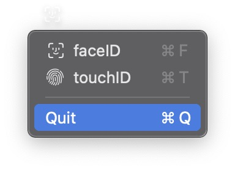
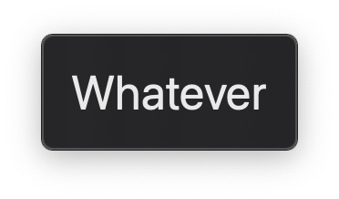
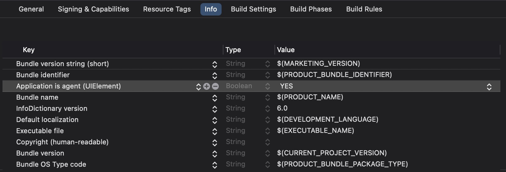

Creating a menu bar app may seem like a complicated task, but it’s actually quite simple. Here's how you can get started.  

## Basic SwiftUI App Structure  

Typically, you’d create a SwiftUI app using a `WindowGroup` like this:

```swift
@main
struct MyApp: App {
    var body: some Scene {
        WindowGroup {
            ContentView()
        }
    }
}
```

However, to create a menu bar app, you simply replace `WindowGroup` with `MenuBarExtra`. Here's how:

```swift
@main
struct MyApp: App {
    var body: some Scene {
        MenuBarExtra {
            ContentView()
        } label: {
            MyAwesomeLabel()
        }
    }
}
```

## MenuBarExtraStyle

As of the time of writing, there are two `MenuBarExtraStyle` options: `menu` (the default) and `window`.   

### Using the `menu` Style  

The `menu` style renders your view in a list format:



```swift
@main struct MyApp: App {

    @State private var authMethod: AuthMethod = .faceID

    var body: some Scene {
        MenuBarExtra {
            ForEach(AuthMethod.allCases) { method in
                Button {

                } label: {
                    HStack {
                        method.icon
                        Text(method.rawValue)
                    }
                }
                .keyboardShortcut(method.shortcut)
            }

            Divider()

            Button("Quit") {
                exit(0)
            }
            .keyboardShortcut("q")
        } label: {
            authMethod.icon
        }
    }
}

enum AuthMethod: String, CaseIterable, Identifiable, Hashable {
    case faceID
    case touchID

    var id: Self { self }

    var icon: Image {
        switch self {
            case .faceID:
                    .init(systemName: "faceid")
            case .touchID:
                    .init(systemName: "touchid")
        }
    }

    var shortcut: KeyEquivalent {
        switch self {
            case .faceID:
                "f"
            case .touchID:
                "t"
        }
    }
}
```

### Using the `window` Style  

The `window` style allows you to customize the view however you like:



```swift
@main struct MyApp: App {

    var body: some Scene {
        MenuBarExtra {
            Text("Whatever")
                .font(.largeTitle)
                .padding()
        } label: {
            Text("Can also be text")
        }
        .menuBarExtraStyle(.window)
    }
}
```

### Example Menu Bar App  

Here’s an example of a menu bar app I built: [JSON Formatter](https://github.com/clive819/JSON-Formatter).

## Hiding the Dock Icon  

By default, your app will show an icon in the Dock. To hide it, update the `Info.plist` file in your project. Add the key:  `Application is agent (UIElement)` with the value `YES`.


