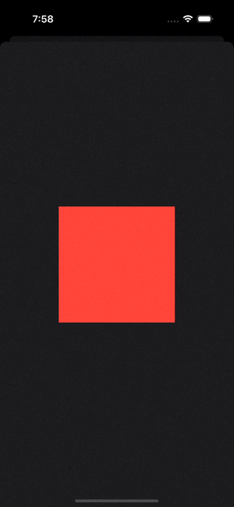
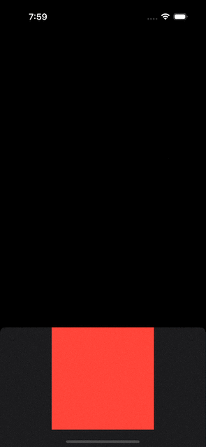
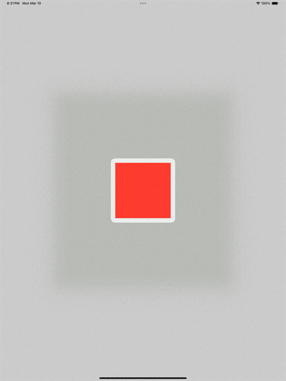

SwiftUI's `sheet` modifier is a fantastic tool, but it comes with limitations: it doesn’t automatically resize to fit its content. Apple introduced the `.presentationSizing(.fitted)` modifier in iOS 18 to address this issue. However, let’s be realistic—convincing your Product Manager to set the minimum deployment target to iOS 18 might not be an easy sell. Sure, you could conditionally enable this feature for users on iOS 18+, but what about those on older OS versions?  

In this article, we’ll explore how to create an auto-sized-to-fit sheet that works on iOS 16.

## Basic Code Structure

Let's start by setting up the basic structure that we’ll build upon throughout this post: 

```swift
Color.clear
    .sheet(isPresented: .constant(true)) {
        MyView()
    }

struct MyView: View {

    @State private var condition: Bool = false

    var body: some View {
        VStack {
            Color.red
                .frame(width: 200, height: 200)

            if condition {
                Color.blue
                    .frame(width: 200, height: 200)
                    .transition(.scale)
            }
        }
        .onTapGesture {
            withAnimation {
                condition.toggle()
            }
        }
    }
}                
```



## Making the Sheet Auto-Resize to Fit 

To make the sheet automatically resize to fit its content, we can define custom `presentationDetents`:

```swift
Color.clear
    .sheet(isPresented: .constant(true)) {
        MyView()
            .modifier(MyAmazingSheetModifier())
    }

struct MyAmazingSheetModifier: ViewModifier {

    @State private var presentationDetents: Set<PresentationDetent> = [.medium]

    func body(content: Content) -> some View {
        content
            .presentationDetents(presentationDetents)
            .onGeometryChange(for: CGSize.self) { proxy in
                proxy.size
            } action: { newValue in
                presentationDetents = [.height(newValue.height)]
            }
    }
}
```



## Adding Animation to the Sheet Resizing

If you try the above, you’ll notice that the sheet resizes **without animation.** Let’s fix that:

```swift
struct MyAmazingSheetModifier: ViewModifier {

    @State private var presentationDetents: Set<PresentationDetent> = [.medium]
    @State private var selectedPresentationDetent: PresentationDetent = .medium

    func body(content: Content) -> some View {
        content
            .presentationDetents(presentationDetents, selection: $selectedPresentationDetent)
            .onGeometryChange(for: CGSize.self) { proxy in
                proxy.size
            } action: { newValue in
                presentationDetents.insert(.height(newValue.height))
                selectedPresentationDetent = .height(newValue.height)
            }
            .transaction { transaction in
                transaction.addAnimationCompletion(criteria: .removed) {
                    presentationDetents = [selectedPresentationDetent]
                }
            }
    }
}
```


### Why This Works 

SwiftUI animates changes in `selectedPresentationDetent` only if the old value is also in the `presentationDetents` set. To enable smooth animation:

1. Add the new height to the `presentationDetents` set. 
2. Update the `selectedPresentationDetent` to animate the transition. 
3. Remove the old detent after the animation completes, preventing users from manually adjusting the sheet height.

## Fixing Layout Jumps in Animations

You may notice that the red rectangle’s frame is affected when the blue rectangle appears, causing a jarring animation. This happens because `MyView`’s frame changes. To address this, we can wrap the content in a `ScrollView`:

```swift
struct MyAmazingSheetModifier: ViewModifier {

    @State private var presentationDetents: Set<PresentationDetent> = [.medium]
    @State private var selectedPresentationDetent: PresentationDetent = .medium

    func body(content: Content) -> some View {
        ScrollView {
            content
                .presentationDetents(presentationDetents, selection: $selectedPresentationDetent)
                .onGeometryChange(for: CGSize.self) { proxy in
                    proxy.size
                } action: { newValue in
                    presentationDetents.insert(.height(newValue.height))
                    selectedPresentationDetent = .height(newValue.height)
                }
                .transaction { transaction in
                    transaction.addAnimationCompletion(criteria: .removed) {
                        presentationDetents = [selectedPresentationDetent]
                    }
                }
        }
        .scrollDisabled(true)
        .frame(maxWidth: .infinity, alignment: .center)
    }
}
```

The `ScrollView` ensures that the content stays anchored to the top, mimicking the behavior of a `ScrollView` itself.


## Supporting Modal Style on Larger Devices

On devices like iPads or Macs, SwiftUI’s `sheet` behaves like a modal rather than a bottom sheet. To make this modal fit its content, we can use the `.presentationBackground` modifier, introduced in iOS 16.4:

```swift
struct MyModalModifier: ViewModifier {

    func body(content: Content) -> some View {
        content
            .presentationBackground(Color.clear)
            .padding()
            .background(.regularMaterial)
            .clipShape(.rect(cornerRadius: 15))
    }
}
```



## Combining Bottom Sheet and Modal Styles

To seamlessly support both bottom sheets and modals, we can adapt based on the environment’s `horizontalSizeClass`. However, since `horizontalSizeClass` always returns `.compact` when read inside a `sheet`, we need to handle this in a custom way:

```swift
Color.clear
    .mySheet(isPresented: .constant(true)) {
        MyView()
    }
   
extension View {

    func mySheet<Content: View>(isPresented: Binding<Bool>, @ViewBuilder content: () -> Content) -> some View {
        self.modifier(MyAmazingSheetModifier(isPresented: isPresented, sheetContent: content()))
    }
}

struct MyAmazingSheetModifier<SheetContent: View>: ViewModifier {

    @Binding var isPresented: Bool

    let sheetContent: SheetContent

    @Environment(\.horizontalSizeClass) private var horizontalSizeClass

    func body(content: Content) -> some View {
        content.sheet(isPresented: $isPresented) {
            if horizontalSizeClass == .compact {
                sheetContent
                    .modifier(MyBottomSheetModifier())
            } else {
                sheetContent
                    .modifier(MyModalModifier())
            }
        }
    }
}
```

Now, the sheet automatically adapts to either bottom sheet or modal style, resizing to fit its content with smooth animations when the content size changes.
