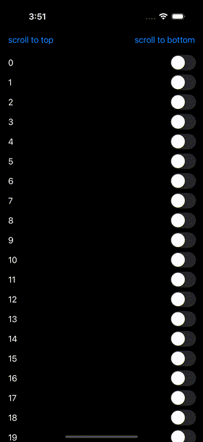

## Recap

[WWDC20 Data Essentials in SwiftUI](https://developer.apple.com/videos/play/wwdc2020/10040)

> Views only exist transiently. After SwiftUI completes a rendering pass, the structs themselves go away. But because we marked this property as State, SwiftUI maintains it for us. The next time the framework needs to render this view, it reinstantiates the structs, and reconnects it to the existing storage.

[WWDC21 Demystify SwiftUI](https://developer.apple.com/videos/play/wwdc2021/10022)

> Whenever we talk about the lifetime of a view, we are referring to the duration of the identity associated with that view. When SwiftUI is looking at your view and sees a State or a StateObject, it knows that it needs to persist that piece of data throughout the view's lifetime. In other words, State and StateObject are the persistent storage associated with your view's identity.

## The issue

As demonstrated in the video below, views near the bottom of the scrollable content lose their state as soon as they go offscreen. In contrast, views near the top tend to preserve their state longer — but even they will reset after enough scrolling.



```swift
struct Demo: View {

    @Namespace private var topID
    @Namespace private var bottomID

    var body: some View {
        NavigationStack {
            ScrollViewReader { proxy in
                ScrollView {
                    Color.clear
                        .frame(width: 0, height: 0)
                        .id(topID)

                    LazyVStack {
                        ForEach(0..<10_000) {
                            MyView(index: $0)
                        }
                    }

                    Color.clear
                        .frame(width: 0, height: 0)
                        .id(bottomID)
                }
                .contentMargins(.horizontal, 16, for: .scrollContent)
                .toolbar {
                    ToolbarItem(placement: .topBarTrailing) {
                        Button("scroll to bottom") {
                            withAnimation {
                                proxy.scrollTo(bottomID)
                            }
                        }
                    }
                    ToolbarItem(placement: .topBarLeading) {
                        Button("scroll to top") {
                            withAnimation {
                                proxy.scrollTo(topID)
                            }
                        }
                    }
                }
            }
        }
    }
}

fileprivate struct MyView: View {

    let index: Int

    @State private var toggle = false

    var body: some View {
        Toggle("\(index)", isOn: $toggle)
            .disabled(toggle)
    }
}
```

The root cause of this issue lies in the use of `LazyVStack` — the same behavior can also be reproduced with `List`. These "lazy" containers discard and recreate views as needed to optimize performance. Unfortunately, this behavior undermines what was promised in [WWDC21’s *Demystify SwiftUI*](https://developer.apple.com/videos/play/wwdc2021/10022/): that `@State` and `@StateObject` provide persistent storage tied to a view’s identity. In this case, the identity of the views never changed, yet the state is still lost. This also contradicts [WWDC20’s *Data Essentials in SwiftUI*](https://developer.apple.com/videos/play/wwdc2020/10040/), which states that when SwiftUI needs to re-render a view, it reinstantiates the struct and reconnects it to the existing state storage — again, not what we see happening here.

A workaround suggested by a DTS engineer involves lifting state to the parent view. However, this isn't always practical — particularly when developing reusable view components. Consumers of your component may place it inside a lazy container, and there’s no way to prevent that. As a result, you’re forced to design every view to externalize its state rather than manage it internally. This not only exposes internal implementation details but also adds unnecessary complexity for consumers. Worse still, when views are deeply nested, this forces state to be passed all the way up to the container, which then has to manage state on behalf of every child — breaking encapsulation and modularity.

This behavior makes it difficult to write clean, reusable SwiftUI APIs. I strongly urge the SwiftUI team to reevaluate how state is handled within lazy containers. The current behavior is inconsistent with SwiftUI's own documentation and WWDC presentations, and it introduces significant friction for developers building scalable, modular UIs.

[https://forums.swift.org/t/pitch-swiftui-stabilize-state-in-lazy-containers/79926](https://forums.swift.org/t/pitch-swiftui-stabilize-state-in-lazy-containers/79926)
